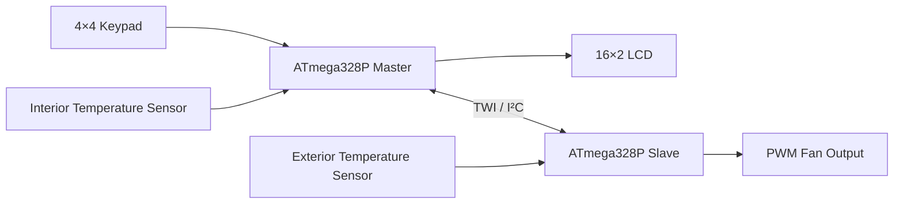

# Automotive HVAC Controller

Dual-microcontroller automotive HVAC prototype built around two ATmega328P devices. The system combines temperature acquisition, a local human-machine interface, TWI/I²C communication, and PWM-based fan control to demonstrate a distributed embedded architecture for vehicle climate-control applications.

## Overview

The project separates supervisory control and delegated input/output tasks between a master and a slave microcontroller. The master coordinates the user interface and operating logic, while the slave exchanges sensor and actuator data through the TWI bus.

The controller supports manual and automatic operation, presents system information on a 16×2 LCD, receives commands through a 4×4 matrix keypad, and regulates ventilation with PWM outputs.

## Key features

- Two ATmega328P microcontrollers in a master–slave architecture
- Interior and exterior temperature acquisition
- Manual and automatic HVAC operating modes
- 16×2 character LCD for status and temperature display
- 4×4 matrix keypad for user input
- TWI/I²C communication between controllers
- PWM fan-speed control
- Interrupt- and polling-based peripheral handling
- Simulation-oriented validation using embedded development tools

## System architecture



The exact assignment of sensing and actuation channels can be adapted without changing the communication-oriented architecture.

## Operating modes

### Manual mode

The user selects the ventilation behavior directly through the keypad. The master updates the display and sends the corresponding command to the slave controller.

### Automatic mode

The controller compares measured temperature conditions against the selected operating target and adjusts the fan command automatically. This mode demonstrates closed-loop decision logic at the embedded-system level.

## Hardware

- 2 × ATmega328P microcontrollers
- 2 × temperature sensors
- 1 × 16×2 LCD
- 1 × 4×4 matrix keypad
- PWM-controlled fan or simulated fan load
- 4.7 kΩ pull-up resistors for SDA and SCL
- Common regulated supply and ground reference

Known interface assignments are documented in [`docs/hardware-connections.md`](docs/hardware-connections.md).

## Repository structure

```text
automotive-hvac-controller/
├── firmware/
│   ├── master/
│   │   └── README.md
│   └── slave/
│       └── README.md
├── docs/
│   ├── architecture.md
│   └── hardware-connections.md
├── simulation/
│   └── README.md
├── .gitignore
├── LICENSE
└── README.md
```

Source files will be incorporated into the appropriate `firmware/master` and `firmware/slave` directories as the original implementation is cleaned and documented.

## Communication model

The controllers communicate over the ATmega328P TWI peripheral using SDA on PC4 and SCL on PC5. Pull-up resistors are required on both bus lines. The slave implementation is designed around TWI status handling and interrupt-driven reception, while the master coordinates periodic commands and data requests.

## Development environment

- AVR-GCC / Microchip Studio
- ATmega328P at 8 MHz or 16 MHz, depending on the tested configuration
- SimulIDE and Proteus for simulation and integration testing
- Embedded C

## Project status

The hardware architecture and original functional implementation have been completed as an academic embedded-systems project. The repository is currently being organized to publish the firmware, technical documentation, connection diagrams, and simulation evidence in a reproducible format.

## Author

**Miguel Ángel Ramírez Mosqueda**  
Automotive Systems Engineering — UPIITA, Instituto Politécnico Nacional

## License

This project is distributed under the [MIT License](LICENSE).
