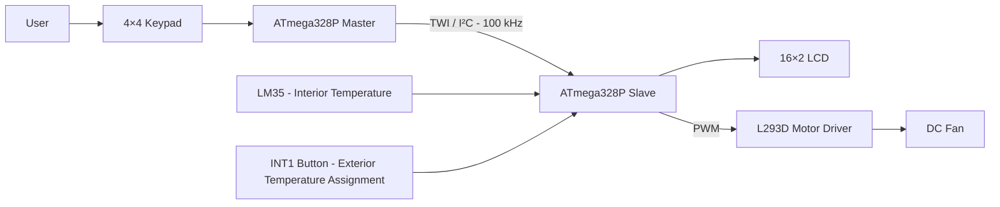
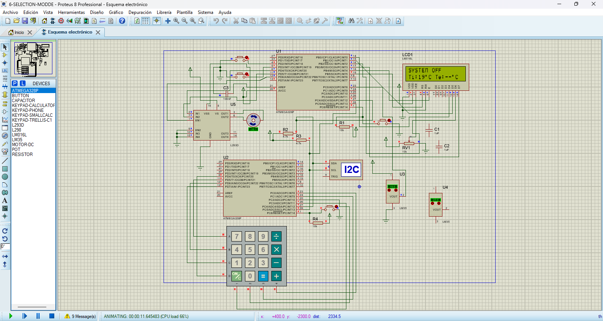
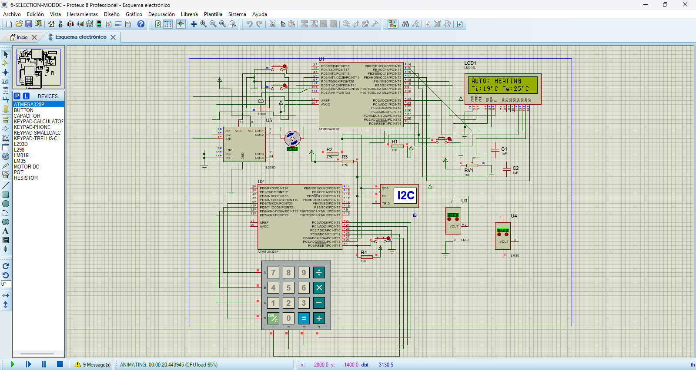
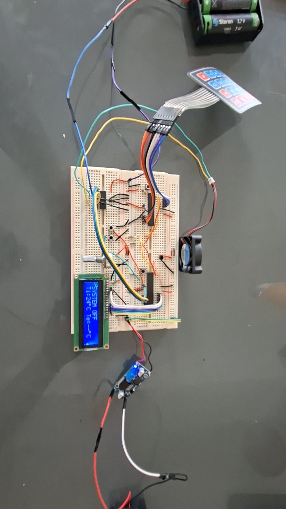

# Automotive HVAC Controller

Dual-microcontroller automotive HVAC prototype based on two ATmega328P devices. The project demonstrates distributed embedded control using TWI/I²C communication, keypad-based user interaction, temperature acquisition, automatic and manual operating modes, LCD feedback, and PWM fan control.

The system was first validated in Proteus and later implemented as a functional physical prototype.

---

## Overview

The controller is divided into two embedded nodes:

- **Master ATmega328P:** handles the 4×4 keypad, user-input processing, operating-mode selection, and TWI command transmission.
- **Slave ATmega328P:** receives commands, reads the LM35 temperature sensor, manages the LCD, evaluates HVAC control logic, and drives the ventilation fan through PWM and an L293D motor driver.

Both microcontrollers operate at **8 MHz** and communicate through the hardware TWI peripheral at **100 kHz**.

---

## Key Features

- Two ATmega328P microcontrollers in a master–slave architecture
- Embedded C firmware using AVR peripherals directly
- TWI/I²C communication at 100 kHz
- Two-byte application protocol: `[Command][Value]`
- 4×4 matrix keypad user interface
- Software keypad debouncing
- Interior temperature measurement using an LM35
- 10-bit ADC using the ATmega328P internal 1.1 V reference
- 16-sample ADC averaging
- 16×2 LCD user feedback
- OFF, Automatic, and Manual operating modes
- Four manual fan levels
- Timer0 Fast PWM fan control
- L293D DC motor driver
- Timer1-based periodic scheduling
- External interrupt (`INT1`) handling
- Proteus simulation validation
- Physical prototype implementation

---

## System Architecture



The master acts primarily as the **human-machine interface and communication node**, while the slave performs the main **sensing, control, display, and actuation tasks**.

For a detailed description, see:

[System Architecture](docs/architecture.md)

---

## User Interface

The 4×4 keypad connected to the master controller is used to operate the system.

| Key | Function |
|---|---|
| `0–9` | Enter a temperature value |
| `*` | Clear the current input |
| `#` | Confirm the entered value |
| `A` | Select Automatic mode |
| `B` | Select Manual mode |
| `C` | Turn the system OFF |
| `D` | Cycle through manual fan levels |

The master converts each valid user action into a TWI application command and transmits it to the slave.

---

## Operating Modes

### OFF

The ventilation fan is disabled.

```text
PWM = 0%
```

---

### Manual Mode

Manual mode allows direct user control of the fan.

Pressing `D` cycles through:

```text
OFF
 ↓
LOW
 ↓
MEDIUM
 ↓
HIGH
 ↓
OFF
```

| Level | PWM value | Approximate duty cycle |
|---|---:|---:|
| OFF | `0` | 0% |
| LOW | `85` | 33% |
| MEDIUM | `170` | 67% |
| HIGH | `255` | 100% |

---

### Automatic Mode

Automatic mode compares the interior and exterior temperatures:

```text
Ti - Te
```

where:

- `Ti` = interior temperature measured by the LM35
- `Te` = exterior temperature entered by the user

A deadband of ±2 °C is used.

| Condition | State | Fan |
|---|---|---|
| `Ti - Te > 2 °C` | COOLING | HIGH |
| `Ti - Te < -2 °C` | HEATING | OFF |
| `-2 °C ≤ Ti - Te ≤ 2 °C` | STABLE | OFF |
| Missing temperature data | WAIT TEMPERATURES | OFF |

The current prototype contains only a ventilation fan.

The `HEATING` state is detected and displayed by the firmware, but no physical heating actuator is implemented.

Detailed operating behavior is documented in:

[System Operation](docs/operation.md)

---

## Temperature Acquisition

### Interior Temperature

The interior temperature is measured using an LM35 connected to `ADC0` on the slave controller.

The ADC configuration includes:

- 10-bit resolution
- Internal 1.1 V reference
- 125 kHz ADC clock
- 16-sample averaging
- 500 ms sampling interval

### Exterior Temperature

The final prototype uses only one physical LM35.

The exterior temperature is entered manually through the keypad:

```text
Enter value
    ↓
Press #
    ↓
Value becomes pending
    ↓
Press INT1 button
    ↓
Value becomes Te
```

This allows different exterior-temperature conditions to be tested without requiring a second physical temperature sensor.

---

## TWI Communication

The controllers communicate using the hardware TWI peripheral.

| Parameter | Value |
|---|---|
| Bus | TWI / I²C |
| Frequency | 100 kHz |
| Slave address | `0x08` |
| SDA | PC4 |
| SCL | PC5 |

The application layer uses a two-byte packet:

```text
+-----------+-----------+
| Command   | Value     |
| 1 byte    | 1 byte    |
+-----------+-----------+
```

Examples:

```text
[0x06][0x01] → Automatic mode
[0x06][0x02] → Manual mode
[0x07][0x03] → HIGH manual fan level
```

The master validates TWI status codes and uses timeout protection.

The slave receives packets through the `TWI_vect` interrupt service routine and processes completed packets in the main application loop.

Full protocol documentation:

[TWI Communication Protocol](docs/communication-protocol.md)

---

## Fan Control

The fan is driven through an L293D motor driver.

The slave connections are:

```text
PD4 → L293D IN1
PD5 → L293D IN2
PD6 → L293D EN1 / OC0A PWM
```

Timer0 operates in Fast PWM mode.

With:

```text
F_CPU = 8 MHz
Prescaler = 8
TOP = 255
```

the PWM frequency is approximately:

```text
3.91 kHz
```

Detailed wiring information is available in:

[Hardware Connections](docs/hardware-connections.md)

---

## Proteus Simulation

The system was validated in Proteus before physical implementation.



### Manual Mode



### Automatic Mode


The simulation was used to validate:

- Master–slave communication
- Keypad input
- TWI command transmission
- LCD feedback
- Temperature handling
- Manual fan control
- Automatic control logic
- PWM output behavior

Additional information is available in:

[Simulation and Validation](simulation/README.md)

---

## Physical Prototype

The simulated design was later implemented using physical hardware.



The physical prototype was used to verify the interaction between:

- Both ATmega328P controllers
- 4×4 keypad
- LM35
- LCD
- TWI bus
- L293D motor driver
- DC motor
- Manual mode
- Automatic control logic

### Demonstration Videos

- [Watch the manual-mode prototype demonstration](media/prototype/videos/manual-mode.mp4)
- [Watch the automatic-mode prototype demonstration](media/prototype/videos/automatic-mode.mp4)

---

## Firmware

The firmware is divided into two independent applications.

```text
firmware/
├── master/
│   └── main.c
└── slave/
    └── main.c
```

### Master Firmware

The master implements:

- Keypad scanning
- Keypad debouncing
- Numeric input capture
- Mode selection
- Manual fan-level selection
- TWI master communication
- Communication timeout handling

### Slave Firmware

The slave implements:

- TWI interrupt-driven reception
- LM35 ADC acquisition
- LCD management
- Automatic HVAC control logic
- Manual fan-level control
- Timer0 PWM
- Timer1 scheduling
- INT1 handling
- L293D motor control

The firmware was developed in Embedded C for the ATmega328P using AVR-GCC / Microchip Studio.

---

## Repository Structure

```text
automotive-hvac-controller/
├── firmware/
│   ├── master/
│   │   └── main.c
│   └── slave/
│       └── main.c
│
├── docs/
│   ├── architecture.md
│   ├── communication-protocol.md
│   ├── hardware-connections.md
│   └── operation.md
│
├── simulation/
│   ├── images/
│   │   ├── automatic-simulation.png
│   │   ├── manual-overview.png
│   │   └── proteus-overview.png
│   └── README.md
│
├── media/
│   └── prototype/
│       ├── images/
│       │   └── final-assembly.jpg
│       └── videos/
│           ├── automatic-mode.mp4
│           └── manual-mode.mp4
│
├── .gitignore
├── LICENSE
└── README.md
```

---

## Technical Documentation

| Document | Description |
|---|---|
| [System Architecture](docs/architecture.md) | Functional distribution between both controllers |
| [TWI Communication Protocol](docs/communication-protocol.md) | Packet format, commands, TWI states, and error handling |
| [Hardware Connections](docs/hardware-connections.md) | Complete master/slave pinout and peripheral wiring |
| [System Operation](docs/operation.md) | Manual, automatic, OFF, temperature, LCD, and PWM behavior |
| [Simulation and Validation](simulation/README.md) | Proteus validation and prototype evidence |

---

## Technologies and Concepts

This project applies:

- Embedded C
- AVR-GCC
- ATmega328P
- GPIO
- ADC
- Timers
- PWM
- External interrupts
- TWI / I²C
- Interrupt service routines
- Matrix-keypad scanning
- Software debouncing
- LCD interfacing
- Motor-driver control
- Distributed embedded architecture
- Hardware–software integration
- Simulation and physical validation

---

## Project Status

The HVAC controller has been implemented and validated as a functional embedded-system prototype.

The repository documents the final firmware, communication protocol, hardware interfaces, operating logic, Proteus simulation, and physical implementation.

---

## Limitations

This project is an academic embedded-system prototype and is not intended to represent a production automotive HVAC ECU.

The current implementation does not include:

- A physical heating actuator
- A second physical exterior-temperature sensor
- CAN communication
- Automotive diagnostics
- Functional-safety mechanisms
- Automotive-qualified power electronics
- EMC validation
- Production-grade fault handling

---

## Author

**Miguel Ángel Ramírez Mosqueda**  
Automotive Systems Engineering  
UPIITA — Instituto Politécnico Nacional

---

## License

This project is distributed under the [MIT License](LICENSE).