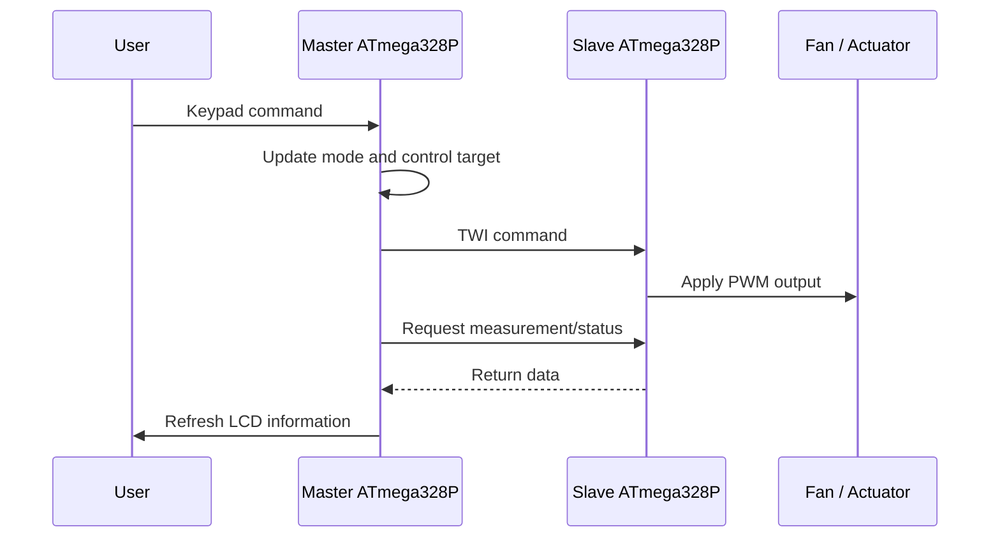

# System Architecture

## Purpose

This project models an automotive HVAC controller as a distributed embedded system. Two ATmega328P microcontrollers divide the user-interface, sensing, communication, and actuation responsibilities instead of concentrating every peripheral on a single device.

## Architectural roles

### Master controller

The master acts as the supervisory node. Its responsibilities include:

- Reading user commands from the 4×4 keypad
- Managing manual and automatic operating modes
- Updating the 16×2 LCD
- Evaluating the high-level HVAC control logic
- Sending commands to the slave through TWI/I²C
- Requesting or receiving remote measurements and status information

### Slave controller

The slave acts as the delegated input/output node. Its responsibilities include:

- Receiving commands from the master
- Acquiring the assigned temperature channel
- Updating the commanded PWM output
- Returning measurement or status data when requested
- Handling TWI states through the peripheral interrupt mechanism

## Data flow

## Control model

In manual mode, the fan command is selected directly by the user. In automatic mode, the master derives an output command from the measured thermal conditions and the configured target.

The architecture intentionally separates policy from execution:

- The master decides what the system should do.
- The slave performs the delegated measurement or actuation task.

This separation makes the design easier to extend with additional sensors, actuators, or communication diagnostics.

## Communication considerations

The TWI bus uses the ATmega328P hardware interface:

- SDA: PC4
- SCL: PC5
- External pull-ups: 4.7 kΩ on SDA and SCL

The implementation must account for address acknowledgement, received-data states, bus errors, and recovery from unexpected status values. The master and slave must also share a common ground reference.

## Design limitations

This repository documents an academic prototype rather than a production automotive electronic control unit. It does not currently implement automotive-qualified hardware, CAN communication, functional-safety mechanisms, electromagnetic-compatibility validation, or production diagnostics.
